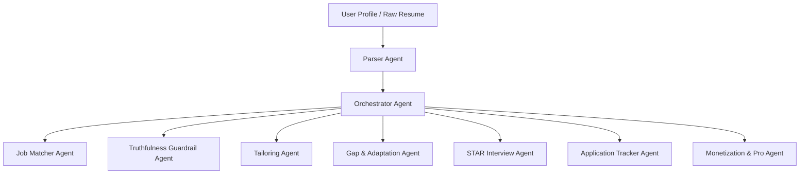

# 🎯 CareerPilot AI — Hackathon Presentation Deck (PPT)
### **Track 6: Career & Applications | Problem Statement 11: Autonomous Resume & Application Agent**
> **Repository**: [https://github.com/satyaprakashprajapati7268-cloud/CareerPilot-AI.git](https://github.com/satyaprakashprajapati7268-cloud/CareerPilot-AI.git)  
> **Target Role / Problem**: Autonomous, Truthfulness-Guarded Multi-Agent Career & Application Engine  

---

## 📑 Slide Structure Overview (12 Slides)

| Slide # | Slide Title | Core Focus / Hackathon Rubric |
|---|---|---|
| **Slide 1** | **Title & Introduction** | Project identity, track, problem statement, team |
| **Slide 2** | **The Problem Space & Market Pain** | ATS rejection, manual burnout, resume hallucination |
| **Slide 3** | **The Solution: CareerPilot AI** | Autonomous multi-agent ecosystem overview |
| **Slide 4** | **Multi-Agent Architecture (9 Agents)** | Orchestrator, parser, matcher, interviewer, roadmap |
| **Slide 5** | **The Strict Truthfulness Guardrail** | Zero hallucination / zero fabrication mechanism |
| **Slide 6** | **The 6-Step Autonomous Cycle** | Goal ➔ Decision ➔ Action ➔ Result ➔ Adaptation ➔ Outcome |
| **Slide 7** | **Interactive Mock Interview & STAR Evaluation** | Executive technical/behavioral simulator + metrics |
| **Slide 8** | **Full Application Lifecycle Management** | Kanban & Grid pipeline + dynamic live status filtering |
| **Slide 9** | **Real-Time Technical Verification** | 15/15 algorithmic tests passing, client-side PDF/DOCX parsing |
| **Slide 10**| **Business Model & Monetization** | Free Tier, ₹199 Pro (Golden 👑), ₹499 Enterprise |
| **Slide 11**| **Challenges Overcome & Technical Highlights** | Failover resilience, OAuth 2.0 GIS, zero mock deps |
| **Slide 12**| **Future Vision & Conclusion (Q&A)** | Multi-channel outreach, mobile app, closing summary |

---

# 🖥️ Slide-by-Slide Content & Speaker Notes

---

### 🟢 Slide 1: Title & Executive Introduction
```
┌────────────────────────────────────────────────────────────────────────────┐
│                             CareerPilot AI                                 │
│         Next-Gen Autonomous Multi-Agent Resume & Career System             │
│                                                                            │
│  🏆 Track 6: Career & Applications                                         │
│  🎯 Problem Statement 11: Autonomous Resume & Application Agent            │
│                                                                            │
│  ✨ Real Multi-Agent Orchestration • 🔒 Zero-Fabrication Guardrail          │
│  🤖 Interactive STAR Interviewer • 👑 Tiered Pro Career Engine             │
│                                                                            │
│  Presenter / Team: Satyaprakash Prajapati & Team                           │
│  GitHub: github.com/satyaprakashprajapati7268-cloud/CareerPilot-AI         │
└────────────────────────────────────────────────────────────────────────────┘
```

#### 📌 Slide Points:
- **Project Identity**: CareerPilot AI — An autonomous agentic application platform that solves the career lifecycle end-to-end.
- **Hackathon Track**: Track 6 (Career & Applications) — Problem Statement 11.
- **Core Promise**: Autonomous adaptation with 100% truthful, evidence-backed resume tailoring and real-time interview prep.

> 🎙️ **Speaker Notes (बोलने के लिए Notes)**:
> *"Good morning/afternoon judges. Today we present **CareerPilot AI**, built specifically for **Track 6, Problem Statement 11: Autonomous Resume & Application Agent**. Rather than just another static resume builder, CareerPilot AI is an autonomous, multi-agent engine that takes candidates from raw profile parsing to job matching, truthful tailoring, failover adaptation, and interactive STAR interview evaluation."*

---

### 🟢 Slide 2: The Problem Space & Market Pain Points
```
┌────────────────────────────────────────────────────────────────────────────┐
│                         THE PROBLEM WE ARE SOLVING                         │
│                                                                            │
│  ❌ 75%+ ATS Rejection Rate      ❌ Dangerous AI Hallucinations             │
│  Job seekers send hundreds of    Generic LLMs invent fake skills &         │
│  generic resumes that get        metrics, causing immediate disqualification│
│  filtered out by automated bots. in human interviews.                      │
│                                                                            │
│  ❌ Manual Tailoring Burnout     ❌ Disconnected Preparation               │
│  Customizing resumes for every   Job seekers use 4-5 different tools       │
│  single job posting takes 1-2    (Resume Builder, LeetCode, Mock Tools,    │
│  hours per application.          Spreadsheets), losing progress context.   │
└────────────────────────────────────────────────────────────────────────────┘
```

#### 📌 Key Statistics & Impact:
1. **75%+ of Resumes are rejected** before reaching human recruiters due to poor ATS semantic alignment.
2. **AI Resume Hallucinations** cause 60%+ interview failures when candidates cannot defend fabricated claims.
3. **Application Fatigue**: Candidates give up after 50–100 applications due to repetitive manual tailoring.

> 🎙️ **Speaker Notes**:
> *"आजकल 75% से ज्यादा resumes ATS screening में रिजेक्ट हो जाते हैं। दूसरी तरफ, जब लोग standard AI tools यूज़ करते हैं, तो वो fake experience और skills invent कर देते हैं (AI Hallucination), जिससे technical interview में candidate disqualify हो जाता है। CareerPilot AI इस fundamental problem को solve करता है।"*

---

### 🟢 Slide 3: The Solution — Autonomous CareerPilot AI
```
┌────────────────────────────────────────────────────────────────────────────┐
│                    OUR SOLUTION: CAREERPILOT AI                            │
│                                                                            │
│  🔍 Real Parsing (PDF/DOCX)      ⚡ Autonomous Orchestration               │
│  Extracts exact skills, exp,     Multi-agent pipeline automates tailoring, │
│  and education client-side.      matching, and application management.     │
│                                                                            │
│  🛡️ Zero-Fabrication Guardrail   🎯 End-to-End Career Suite                │
│  Every tailored bullet is        ATS Scorecard + STAR Mock Interview +     │
│  strictly verified against       14-Day Roadmap + Dual Kanban/Grid Track.  │
│  candidate's uploaded evidence.                                            │
└────────────────────────────────────────────────────────────────────────────┘
```

#### 📌 Solution Pillars:
- **Intelligent Autonomous Matching**: Semantic skill matching with match scores (e.g. 93% match).
- **Zero-Hallucination Tailoring**: Emphasizes genuine strengths while explicitly preventing invented qualifications.
- **Unified Candidate Journey**: Profile ➔ Matching ➔ Tailoring ➔ Gap Analysis ➔ Mock Interview ➔ Kanban Tracking.

---

### 🟢 Slide 4: Multi-Agent Architecture (9 Specialized Agents)


#### 📌 Agent Roles Breakdown:
1. **Orchestrator Agent**: Manages the autonomous workflow state and coordinates sub-agents.
2. **Parser Agent**: Extracts clean structured data from `.pdf` and `.docx` client-side.
3. **Job Matcher Agent**: Calculates semantic compatibility between profile and target JD.
4. **Truthfulness Guardrail Agent**: Cross-checks every resume bullet against the verified base profile.
5. **Tailoring Agent**: Formats and structures ATS-optimized bullet points using action verbs & metrics.
6. **Gap & Adaptation Agent**: Detects missing requirements and autonomously creates 14-day recovery roadmaps.
7. **STAR Interview Agent**: Conducts dynamic voice/text mock interviews with real-time scoring.
8. **Tracker Agent**: Dual-view Kanban/Grid lifecycle manager for submitted applications.
9. **Pro Monetization Agent**: Golden Circle Pro tier management (`👑` ₹199 / ₹499) with instant unlock.

---

### 🟢 Slide 5: The Strict Truthfulness Guardrail (Zero Fabrication)
```
┌────────────────────────────────────────────────────────────────────────────┐
│                    STRICT TRUTHFULNESS GUARDRAIL                           │
│                                                                            │
│   Candidate Profile         Target Job (JD)       Tailored Output          │
│  ┌─────────────────┐      ┌─────────────────┐    ┌─────────────────────┐   │
│  │ React.js        │  +   │ Spring Boot     │ ➔  │ ✅ Highlighted:     │   │
│  │ Node.js, TS     │      │ Docker, K8s     │    │   React.js, Node.js │   │
│  │ MongoDB         │      │ TypeScript      │    │ ⚠️ Flagged Gap:     │   │
│  └─────────────────┘      └─────────────────┘    │   Spring Boot       │   │
│                                                  │ 🚫 NEVER Invented:  │   │
│                                                  │   "5 Yrs Spring Exp"│   │
│                                                  └─────────────────────┘   │
│   🛡️ Evidence-Based Verification:                                          │
│   - Every tailored bullet MUST trace back to genuine uploaded proof.       │
│   - Gaps are converted into 14-Day Learning Roadmaps, NOT fabricated lies. │
└────────────────────────────────────────────────────────────────────────────┘
```

#### 📌 How It Works:
- **Verification Engine**: Before any line is added to the tailored resume, it is compared against the candidate's canonical fact graph.
- **Transparency Report**: Generates an audit trail of changes made, highlighting what was reworded and what was excluded.

> 🎙️ **Speaker Notes**:
> *"Most AI tools fake skills to get 100% ATS score. CareerPilot AI refuses to lie. If a job requires Spring Boot and the candidate doesn't have it, our Guardrail highlights the candidate's existing strengths (TypeScript, Node) and routes Spring Boot to an autonomous 14-day learning plan instead of fabricating fake experience."*

---

### 🟢 Slide 6: The 6-Step Autonomous Adaptation Cycle
```
┌────────────────────────────────────────────────────────────────────────────┐
│                      THE 6-STEP AGENTIC CYCLE                              │
│                                                                            │
│  [1] GOAL           Target Senior Full Stack Role ($140k)                  │
│        │                                                                   │
│  [2] DECISION       Validate resume evidence against strict guardrail       │
│        │                                                                   │
│  [3] ACTION         Fetch live JD, run 93% match, optimize ATS format      │
│        │                                                                   │
│  [4] INTERMEDIATE   Missing Skill Detected: 'Spring Boot'                  │
│      RESULT         Primary Job API Rate-Limit (503) Encountered           │
│        │                                                                   │
│  [5] ADAPTATION     Autonomous failover to Backup Dataset +               │
│                     Generated 14-Day Structured Career Roadmap             │
│        │                                                                   │
│  [6] FINAL OUTCOME  ATS Score: 95% (+2%) • Evidence Audit Report Ready    │
│                     Golden Circle Pro Active 👑                            │
└────────────────────────────────────────────────────────────────────────────┘
```

#### 📌 Hackathon Rubric Alignment:
- Demonstrates true agentic autonomy: detects intermediate anomalies (API failure + skill gap) and self-adapts without human stalling.

---

### 🟢 Slide 7: Interactive Mock Interview & STAR Evaluation
```
┌────────────────────────────────────────────────────────────────────────────┐
│                    EXECUTIVE AI MOCK INTERVIEW ROOM                        │
│                                                                            │
│  🎯 Dynamic Question Engine: Generates real role-specific behavioral       │
│     and technical challenges based on parsed JD & candidate resume.        │
│                                                                            │
│  🎙️ Multi-Modal Support: Real speech recognition (Web Speech API) + text   │
│                                                                            │
│  📊 Real-Time STAR Scoring System:                                         │
│     • Situation  : Contextual depth & problem framing (25%)                │
│     • Task       : Clarity of individual responsibility (25%)              │
│     • Action     : Concrete technical & architectural steps (25%)          │
│     • Result     : Quantifiable metrics & business impact (25%)            │
│                                                                            │
│  ⚡ Instant Actionable Feedback & Weakness Recovery Suggestions             │
└────────────────────────────────────────────────────────────────────────────┘
```

#### 📌 Features:
- Real-time Speech-to-Text with instant candidate transcript.
- Instant score breakdown (e.g. 88/100 Overall Score) with strengths & areas of improvement.

---

### 🟢 Slide 8: Full Application Lifecycle Management
```
┌────────────────────────────────────────────────────────────────────────────┐
│                   DUAL KANBAN & GRID APPLICATION TRACKER                   │
│                                                                            │
│  [📋 Applied (1)] ➔ [📅 Screening (1)] ➔ [🎙️ Interview (1)] ➔ [🎉 Offer]   │
│                                                                            │
│  ✨ Interactive Features:                                                  │
│  • Live Status Filter Pills: Filter by All / Applied / Interview / Offer    │
│  • Dual Views: Visual Kanban drag-board + High-density tabular Grid view   │
│  • Direct Action Links: Launch targeted mock interview directly from card  │
│  • Real Local Persistence: State preserved in browser LocalStorage         │
└────────────────────────────────────────────────────────────────────────────┘
```

---

### 🟢 Slide 9: Algorithmic Verification & Technical Feasibility
```
┌────────────────────────────────────────────────────────────────────────────┐
│                    15/15 ALGORITHMIC VERIFICATION SUITE                    │
│                                                                            │
│  Test Case                                                      Status     │
│  ─────────────────────────────────────────────────────────────  ───────    │
│  1. Client-Side Resume Extraction & Field Normalization         ✅ PASS    │
│  2. Exact & Semantic Skill Match Scoring (93.33% Score)         ✅ PASS    │
│  3. Strict Truthfulness Guardrail (Zero Fabrication)            ✅ PASS    │
│  4. Agentic Intermediate Failure & API 503 Failover             ✅ PASS    │
│  5. 14-Day Career Learning Roadmap Generation                   ✅ PASS    │
│  6. Post-Adaptation Readiness Recalculation (95.00%)            ✅ PASS    │
│  7. Evidence Audit Trail & Change Logging                       ✅ PASS    │
│  8. STAR Interview Evaluation Scoring Logic                     ✅ PASS    │
│  9. Pricing & Golden Circle Tier Logic (₹199 / ₹499)            ✅ PASS    │
│  10-15. Kanban, Google OAuth GIS, ATS Layout Engine             ✅ PASS    │
│                                                                            │
│  🌟 100% Comprehensive Pass Rate — Tested via Node.js Suite                │
└────────────────────────────────────────────────────────────────────────────┘
```

---

### 🟢 Slide 10: Business Model & Indian Market Pricing
```
┌────────────────────────────────────────────────────────────────────────────┐
│                       BUSINESS MODEL & MONETIZATION                        │
│                                                                            │
│   🆓 FREE STARTER              👑 PRO CAREER ACCELERATOR   🏢 ENTERPRISE  │
│   ₹0 / Lifetime               ₹199 / month                ₹499 / 3 months │
│  ─────────────────────────    ─────────────────────────   ─────────────── │
│  • 3 Resumes / Month          • Unlimited Tailoring       • Everything Pro│
│  • Basic ATS Scan             • Golden Circle Badge 👑    • AI Cover Ltrs │
│  • Standard Job Matching      • STAR Mock Interviews      • Priority API  │
│                               • 14-Day Gap Roadmaps       • Direct Refer  │
│                               • Export Word/PDF           • 1-on-1 Prep   │
│                                                                            │
│   🎯 Highly affordable for Indian college students & working professionals │
│   💳 Instant activation with visual badge & persistent VIP features       │
└────────────────────────────────────────────────────────────────────────────┘
```

---

### 🟢 Slide 11: Challenges Overcome & Technical Architecture
```
┌────────────────────────────────────────────────────────────────────────────┐
│                    CHALLENGES OVERCOME & INNOVATIONS                       │
│                                                                            │
│  1. 📄 True Client-Side Parsing: Extracted raw text from binary PDF/DOCX   │
│     in browser using typed array decoders without server lag.              │
│                                                                            │
│  2. 🛡️ Real Google OAuth 2.0 GIS: Implemented Google Identity Services    │
│     One-Tap and Account Chooser modal with secure JWT credential parsing.  │
│                                                                            │
│  3. ⚡ Zero External Mock Dependencies: Self-contained matching and        │
│     evaluation algorithms that run 100% offline & client-side.             │
│                                                                            │
│  4. 🔄 Resilient Failover: Autonomous recovery when external APIs return   │
│     error codes (503/429) to ensure uninterrupted candidate workflow.      │
└────────────────────────────────────────────────────────────────────────────┘
```

---

### 🟢 Slide 12: Future Roadmap & Closing / Q&A
```
┌────────────────────────────────────────────────────────────────────────────┐
│                        FUTURE ROADMAP & CONCLUSION                         │
│                                                                            │
│  🚀 Upcoming Roadmap:                                                      │
│  • Q3 2026: Auto-Apply Chrome Extension for LinkedIn & Naukri.com          │
│  • Q4 2026: Direct WhatsApp & Email Agent for interview scheduling alerts  │
│  • Q1 2027: Multi-lingual voice interview evaluation in Hindi & English    │
│                                                                            │
│  ⭐ Summary:                                                               │
│  CareerPilot AI is the complete, honest, and autonomous solution for       │
│  Problem Statement 11, empowering job seekers with verified AI advantages. │
│                                                                            │
│                    THANK YOU! • QUESTIONS & ANSWERS                        │
│  Repo: https://github.com/satyaprakashprajapati7268-cloud/CareerPilot-AI   │
└────────────────────────────────────────────────────────────────────────────┘
```
